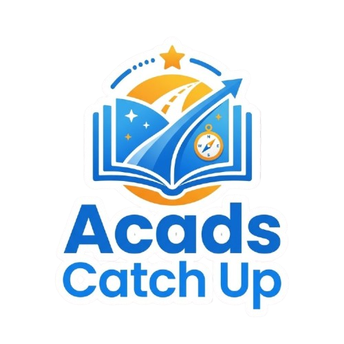

<div align="center">

  

  # AcadsCatchUp

  **Academic Deficiencies & Remediation Management System**

  *A modern, cross-platform desktop application empowering educators and students to track, manage, and resolve academic deficiencies with real-time notifications, 2FA security, and dual database support.*

  <p align="center">
    <a href="#key-features"><b>Key Features</b></a> &nbsp;•&nbsp;
    <a href="#system-architecture"><b>Architecture</b></a> &nbsp;•&nbsp;
    <a href="#quick-start"><b>Quick Start</b></a> &nbsp;•&nbsp;
    <a href="#building-from-source"><b>Build</b></a> &nbsp;•&nbsp;
    <a href="#database-setup"><b>Database</b></a> &nbsp;•&nbsp;
    <a href="#security"><b>Security</b></a> &nbsp;•&nbsp;
    <a href="#license"><b>License</b></a>
  </p>

  [](https://openjdk.org/)
  [](https://openjfx.io/)
  [](https://www.mysql.com/)
  [](https://www.sqlite.org/)
  [](#license)
  [](#quick-start)
  [](https://github.com/ZEKESAMP/AcadsCatchUp/actions)

</div>

---

<a id="overview"></a>
## 📖 Overview

**AcadsCatchUp** is an enterprise-grade academic remediation tracking solution built using JavaFX and modern MVC/DAO architectural patterns. It bridges the communication gap between university faculty and students by centralizing the identification, assignment, submission, and grading of missed school requirements (Activities, Quizzes, Examinations, and Assignments).

Designed with resilience and user experience in mind, AcadsCatchUp features:
- **Zero-Config Deployment**: Built-in SQLite database engine requires no external server setup to run out of the box.
- **Enterprise MySQL Mode**: Seamlessly switches to production MySQL servers for campus-wide network installations.
- **Modern Dark Theme**: Ergonomic, accessibility-tested dark interface crafted with responsive CSS stylesheets.
- **Cross-Platform**: Run natively on Windows, Linux, and macOS with standalone bundles and executable launchers.

---

<a id="key-features"></a>
## ⚡ Key Features

### 👥 Role-Based Workspaces
- **🎓 Student Portal**: Real-time dashboard showing enrolled courses, pending deficiencies, submission deadlines, submission status (`PENDING`, `SUBMITTED`, `GRADED`), and direct inbox messaging with instructors.
- **👨‍🏫 Professor Dashboard**: Course management, batch student enrollment, automated deficiency assignment, digital submission reviewing, grading workflow, and student progress analytics.
- **🛡️ Administrator Suite**: Complete institutional oversight — user account management, professor assignment, faculty deletion/audit, system configuration, SMTP email integration, and security audit logs.

### 🔐 Enterprise Security & Integrity
- **Salted SHA-256 Passwords**: Cryptographically secure 16-byte `SecureRandom` salting with transparent automatic migration for legacy credentials.
- **Dual-Engine Email Verification**: Integrated AbstractAPI real-time mailbox deliverability checking combined with secure SMTP transport.
- **Two-Factor Authentication (2FA)**: Time-limited 6-digit OTP verification for secure login, password resets, and high-privilege operations.
- **Credential Obfuscation**: Backend credentials protected with multi-layer XOR obfuscation preventing memory and source-inspection leakage.
- **DeveloperGuard Anti-Tamper**: Built-in compile-time and runtime integrity validation across all 44 subsystem components.

### 🔔 Live Sync & Notifications
- **Background Synchronization**: Low-overhead daemon polling updates dashboards in real-time without disrupting the user.
- **Native OS & In-App Alerts**: Native toast notifications on Windows with cross-platform fallback popups and audible acoustic feedback.
- **Direct Inbox Messaging**: Context-rich communication tied directly to specific course requirements and missed activities.

---

<a id="role-matrix"></a>
## 📊 Role Capability Matrix

| Feature | Student | Professor | Administrator |
| :--- | :---: | :---: | :---: |
| View Personal Academic Deficiencies | ✅ | — | — |
| Submit Remediation Files & Notes | ✅ | — | — |
| Receive Inbox Messages & Notifications | ✅ | ✅ | ✅ |
| Submit Helpdesk Reports | ✅ | ✅ | — |
| Review & Grade Submissions | — | ✅ | — |
| Create & Assign Missed Items | — | ✅ | ✅ |
| Enroll / Manage Students in Courses | — | ✅ | ✅ |
| Export Deficiencies to CSV / Spreadsheet | — | ✅ | ✅ |
| Manage Professor Accounts & Roles | — | — | ✅ |
| Configure Global SMTP & Security Keys | — | — | ✅ |
| Manage All User Accounts & Audits | — | — | ✅ |

---

<a id="system-architecture"></a>
<a id="architecture"></a>
## 🏗️ System Architecture

AcadsCatchUp is organized into strict architectural boundaries ensuring clean separation of concerns, testability, and maintainability:

```
AcadsCatchUp
├── com.acadscatchup
│   ├── AppLauncher.java              # Application Bootstrap & JavaFX Lifecycle
│   ├── controller                    # Presentation & UI Event Handlers
│   │   ├── LoginController.java
│   │   ├── StudentDashboardController.java
│   │   ├── ProfDashboardController.java
│   │   ├── ManageUsersController.java
│   │   ├── AdminInboxController.java
│   │   └── ...
│   ├── dao                           # Data Access Object Layer
│   │   ├── UserDAO.java
│   │   ├── SubjectDAO.java
│   │   ├── MissedItemDAO.java
│   │   ├── InboxDAO.java
│   │   └── HelpReportDAO.java
│   ├── db                            # Persistence Engine
│   │   └── DBConnection.java         # Dual SQLite / MySQL Connector & Schemas
│   ├── model                         # Domain Data Entities
│   │   ├── User.java
│   │   ├── Subject.java
│   │   ├── MissedItem.java
│   │   └── InboxMessage.java
│   └── util                          # Core Security, Network & Utilities
│       ├── PasswordUtil.java         # Salted SHA-256 Hashing & Verification
│       ├── EmailService.java         # SMTP Dispatcher & 2FA Engine
│       ├── GmailLookupUtil.java      # Multi-API Mailbox Deliverability Verifier
│       ├── DeveloperGuard.java       # Subsystem Integrity & Tamper Protection
│       ├── LiveSyncService.java      # Real-Time Background Synchronization
│       └── ...
```

---

<a id="quick-start"></a>
## 🚀 Quick Start

### Windows (Portable / Pre-packaged)
1. Download the latest release from the [Releases](https://github.com/ZEKESAMP/AcadsCatchUp/releases) page:
   - **`AcadsCatchUp.exe`** — Self-extracting, zero-dependency standalone executable.
   - **`AcadsCatchUp-v1.0.zip`** — Portable zip distribution.
2. Extract the archive (or launch `AcadsCatchUp.exe`).
3. Run `AcadsCatchUp.exe` or `Launch_AcadsCatchUp.bat`.

### Linux
1. Ensure Java 21+ and JavaFX are installed on your distribution:
   ```bash
   # Ubuntu / Debian
   sudo apt update && sudo apt install openjdk-21-jre openjfx
   ```
2. Download and extract `AcadsCatchUp-Linux.tar.gz`.
3. Make the launcher executable and run:
   ```bash
   chmod +x Launch_AcadsCatchUp.sh
   ./Launch_AcadsCatchUp.sh
   ```

### macOS / Cross-Platform
Run the standalone Fat JAR with your installed Java 21 runtime:
```bash
java -jar AcadsCatchUp.jar
```

---

<a id="building-from-source"></a>
<a id="build"></a>
## 🛠️ Building from Source

### Prerequisites
- **Java Development Kit (JDK)**: Version 21 or higher
- **Git** (optional, for cloning)

### Step-by-Step Compilation

1. **Clone the repository:**
   ```bash
   git clone https://github.com/ZEKESAMP/AcadsCatchUp.git
   cd AcadsCatchUp
   ```

2. **Build on Windows:**
   Simply run the automated build script:
   ```cmd
   build_app.bat
   ```
   *This compiles all source modules, verifies `DeveloperGuard` signatures across all 44 classes, bundles resources, and packages the standalone Fat JAR into `dist/`.*

3. **Build on Linux / macOS:**
   ```bash
   # Create classes directory
   mkdir -p target/classes

   # Compile with bundled offline dependencies
   javac -encoding UTF-8 -d target/classes \
     -cp "target/libs/*:target/libs/javafx-sdk-21/lib/*" \
     $(find src/main/java -name "*.java")

   # Copy application resources
   cp -r src/main/resources/* target/classes/

   # Package standalone JAR
   jar -cfm dist/AcadsCatchUp.jar target/MANIFEST.MF -C target/classes .
   ```

4. **Verify Subsystem Integrity:**
   ```powershell
   pwsh ./verify_developer_guard.ps1
   ```

---

<a id="database-setup"></a>
<a id="database"></a>
## 🗄️ Database Setup

### Option 1: SQLite (Default — Zero-Config)
By default, if no external MySQL server is reachable, AcadsCatchUp automatically provisions and initializes a local, file-based SQLite database (`acadscatchup.db`). No configuration is necessary.

### Option 2: MySQL (Campus-Wide / Network Deployment)
For shared multi-user installations across university networks:
1. Create a MySQL database (version 8.0 or newer):
   ```sql
   CREATE DATABASE acadscatchup CHARACTER SET utf8mb4 COLLATE utf8mb4_unicode_ci;
   ```
2. Execute the included initialization schema:
   ```bash
   mysql -u your_user -p acadscatchup < src/main/resources/db/init.sql
   ```
3. AcadsCatchUp automatically migrates tables and applies security constraints on connection.

---

<a id="security"></a>
<a id="security-architecture"></a>
## 🔒 Security Architecture

| Security Layer | Implementation Details |
| :--- | :--- |
| **Password Storage** | Salted `SHA-256` with 16-byte cryptographic random salt (`SecureRandom`). Never stored in plaintext. |
| **Backend Obfuscation** | Cryptographic key material, API tokens, and database secrets are encoded with multi-byte XOR transformations. |
| **Mail Transport Security** | SMTP connections enforce explicit `TLSv1.3` / `STARTTLS` encryption on port 587. |
| **Mailbox Validation** | Multi-pool AbstractAPI real-time verification prevents spam and ensures valid recipient mailboxes. |
| **Integrity Guard** | `DeveloperGuard` ensures all 44 compiled classes match the project development watermark. |

---

<a id="contributing"></a>
## 🤝 Contributing

Contributions are welcome! If you would like to help improve AcadsCatchUp:

1. **Fork** the repository.
2. **Create** a feature branch (`git checkout -b feature/AmazingFeature`).
3. **Commit** your changes (`git commit -m 'feat: add amazing feature'`).
4. **Push** to the branch (`git push origin feature/AmazingFeature`).
5. **Open** a Pull Request.

Please ensure all modified Java files maintain `public static final String DEVELOPER = "F4TAL";` to satisfy the project's DeveloperGuard validation.

---

<a id="license"></a>
## 📄 License

This project is licensed under the **GNU General Public License v3.0** — see the [LICENSE](LICENSE) file for details.

```text
AcadsCatchUp — Academic Deficiencies & Make-Up Tasks Tracking System
Copyright (C) 2026 Stevenson James G. Gastanes (F4TAL)

This program is free software: you can redistribute it and/or modify
it under the terms of the GNU General Public License as published by
the Free Software Foundation, either version 3 of the License, or
(at your option) any later version.
```

---

## 👨‍💻 Author & Maintainer

**Stevenson James G. Gastanes (F4TAL)**  
*Lead Developer & System Architect*  
GitHub: [@ZEKESAMP](https://github.com/ZEKESAMP)
