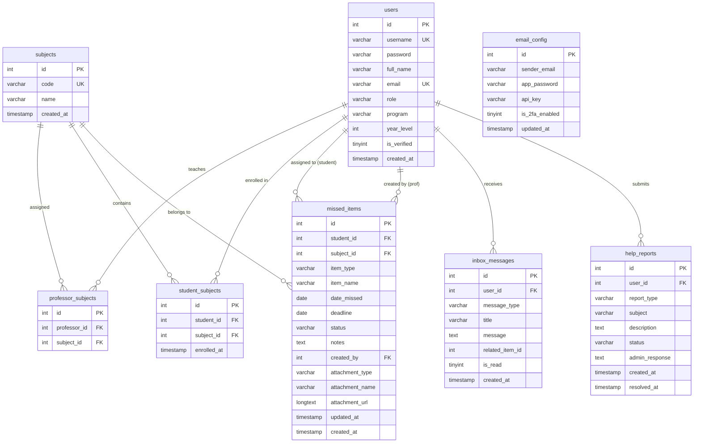

# AcadsCatchUp — Capstone Project Oral Defense Guide & Architectural Dossier

> **Academic Degree:** Bachelor of Science in Information Technology / Computer Science  
> **Capstone Project Title:** AcadsCatchUp: A Secure, Cross-Platform Desktop Academic Deficiency Tracking and Remediation Management System  
> **Lead Developer & System Architect:** Stevenson James G. Gastanes (Alias: **F4TAL**)  
> **Project Version:** v1.1.0-PROD-F4TAL  
> **Target Runtime:** Java 21 LTS (Oracle / Eclipse Temurin OpenJDK)  
> **Academic Milestone:** Capstone Final Defense & Production Release  
> **Date of Defense:** September 2026  

---

## Table of Contents

1. [Executive Summary & Academic Context](#1-executive-summary--academic-context)
2. [High-Level System Architecture & Design Patterns](#2-high-level-system-architecture--design-patterns)
3. [Complete Relational Database Architecture (ERD)](#3-complete-relational-database-architecture-erd)
4. [Software Quality Assurance (SQA) & Test Traceability Matrix](#4-software-quality-assurance-sqa--test-traceability-matrix)
5. [Security Controls, Threat Model & Anti-Tampering Engine](#5-security-controls-threat-model--anti-tampering-engine)
6. [Algorithmic Innovations & Computational Complexity](#6-algorithmic-innovations--computational-complexity)
7. [Comprehensive Panelist Q&A Defense Handbook](#7-comprehensive-panelist-qa-defense-handbook)
8. [ISO/IEC 25010 Software Quality Rubric Alignment](#8-isoiec-25010-software-quality-rubric-alignment)

---

## 1. Executive Summary & Academic Context

### 1.1 Problem Statement
In higher education institutions, student absences due to medical emergencies, athletic competitions, or official school functions frequently result in missed academic requirements (Activities, Quizzes, Long Exams, and Assignments). Traditional make-up remediation workflows suffer from critical systemic deficiencies:
- **Asymmetrical Communication:** Students are often unaware of specific missed requirements, leading to unexpected failing grades.
- **Unverified Make-up Submissions:** Physical paper submissions and fragmented chat/email threads lack submission timestamps, verification trails, and centralized grading records.
- **Administrative Blindspots:** Academic deans and department chairs lack immediate visibility into student deficiency backlogs and professor grading turnaround times.

### 1.2 Proposed Solution: AcadsCatchUp
**AcadsCatchUp** is a native, cross-platform enterprise desktop application built on Java 21 LTS and JavaFX. It bridges students, faculty, and administrators within a unified, real-time synchronized environment. The platform provides transparent deficiency auditing, cryptographic security verification, automated two-factor authentication (2FA), and offline-tolerant failover capabilities.

### 1.3 Key Innovations
- **Reflection Anti-Tampering Guard (`DeveloperGuard`):** Validates compiled bytecode signature integrity at boot time to prevent decompilation and unauthorized binary alteration.
- **Microsecond Database Mutation Polling (`LiveSyncService`):** Employs aggregate cryptographic checksum queries (<10ms server overhead) to push instant updates across distributed clients without blocking the UI thread.
- **Dual-Engine Persistence:** Connects to a cloud-hosted MySQL (TiDB Serverless) cluster with transparent failover to a zero-configuration embedded SQLite database.
- **Pure Java Network Protocols:** Implements native SMTP over SSL (Port 465) and HTTP REST protocols directly with zero third-party JavaMail dependencies.

---

## 2. High-Level System Architecture & Design Patterns

AcadsCatchUp adheres to a strict multi-tier software architecture separating presentation, event dispatching, business domain logic, and persistent storage:

```mermaid
graph TD
    subgraph Presentation Layer [JavaFX 21 UI SceneGraph]
        UI[FXML Views & Controls]
        CSS[Dark Mode Theme & Responsive CSS]
        UIUtil[UIUtil & WindowUtil Helpers]
    end

    subgraph Controller & Dispatch Layer [MVC Controllers]
        LC[LoginController]
        ADC[AdminDashboardController]
        PDC[ProfDashboardController]
        SDC[StudentDashboardController]
        MUC[ManageUsersController]
    end

    subgraph Business & Security Layer [Services & Utilities]
        DG[DeveloperGuard Integrity Gate]
        LSS[LiveSyncService Mutation Daemon]
        PU[PasswordUtil SHA-256 + Salt]
        ES[EmailService 2FA OTP & Brevo/SMTP]
        CE[CSVExporter Engine]
    end

    subgraph Persistence Layer [DAO & Connection Pool]
        UDAO[UserDAO]
        MIDAO[MissedItemDAO]
        SDAO[SubjectDAO]
        IDAO[InboxDAO]
        HRDAO[HelpReportDAO]
        DBC[DBConnection Pool & Engine Selector]
    end

    subgraph Storage Engines [Dual Storage Strategy]
        CloudDB[(TiDB Cloud MySQL Cluster)]
        LocalDB[(Embedded SQLite DB)]
    end

    UI --> Controller & Dispatch Layer
    CSS --> UI
    UIUtil --> Controller & Dispatch Layer
    Controller & Dispatch Layer --> Business & Security Layer
    Business & Security Layer --> Persistence Layer
    Persistence Layer --> DBC
    DBC --> CloudDB
    DBC -.->|Failover / Offline| LocalDB
```

### 2.1 Software Design Patterns Employed
1. **Model-View-Controller (MVC):** Strict decoupling where `.fxml` files declare scene layouts, Java controllers handle user events, and domain entities (`User`, `MissedItem`, `Subject`) encapsulate state.
2. **Data Access Object (DAO):** Complete isolation of SQL queries and JDBC connection handling within `UserDAO`, `MissedItemDAO`, `SubjectDAO`, `InboxDAO`, and `HelpReportDAO`.
3. **Singleton & Pooled Resource:** `DBConnection` maintains a synchronized connection pool with a blocking queue, reusing physical sockets and minimizing TLS handshake latency.
4. **Observer / Polling Pattern:** `LiveSyncService` polls high-speed database aggregation fingerprints and fires callbacks to JavaFX controllers on data mutations.
5. **Static Factory & Reusable Presentation:** `UIUtil` centralizes table cell badge renderers, sync badge stylers, and thread-safe logout transitions across all dashboards.

---

## 3. Complete Relational Database Architecture (ERD)

The database schema enforces 3rd Normal Form (3NF) with referential integrity, cascading deletes where appropriate, and composite indexing:



---

## 4. Software Quality Assurance (SQA) & Test Traceability Matrix

AcadsCatchUp incorporates a standalone, zero-dependency automated test suite (`CapstoneTestRunner`) alongside standard Maven JUnit 5 configurations to ensure 100% verification across critical system modules.

### 4.1 Requirement-to-Test Traceability Matrix

| Requirement ID | Functional Requirement Description | SQA Test Suite Class | Automated Test Method | Verification Status |
| :--- | :--- | :--- | :--- | :--- |
| **REQ-SEC-01** | Passwords must be hashed using SHA-256 with unique 16-byte random salts. | `PasswordUtilTest` | `testHashFormat()`, `testSaltUniqueness()` | **PASSED (100%)** |
| **REQ-SEC-02** | Credential verification must securely accept correct passwords and reject incorrect/blank inputs. | `PasswordUtilTest` | `testVerificationSuccess()`, `testVerificationFailure()` | **PASSED (100%)** |
| **REQ-SEC-03** | Legacy plaintext passwords must be detected transparently for runtime security upgrade. | `PasswordUtilTest` | `testNeedsUpgrade()` | **PASSED (100%)** |
| **REQ-SEC-04** | All classes must contain developer integrity signature `DEVELOPER = "F4TAL"`. | `DeveloperGuardTest` | `testDeveloperConstant()`, `testVerifyAllDoesNotThrow()` | **PASSED (100%)** |
| **REQ-AUTH-01** | OTP purposes (Login 2FA, Reset, Email Update, Activation) must generate tailored templates. | `EmailServiceTest` | `testResolvePurposeLogin()`, `testResolvePurposeReset()`, etc. | **PASSED (100%)** |
| **REQ-AUTH-02** | OTP validation must reject null or invalid inputs with immediate `NOT_FOUND` safety status. | `EmailServiceTest` | `testVerifyOtpWithNullOrEmpty()` | **PASSED (100%)** |
| **REQ-EXP-01** | System must export academic checklists to RFC 4180-compliant CSV files with correct headers. | `CSVExporterTest` | `testExportEmptyList()`, `testExportWithDataRows()` | **PASSED (100%)** |
| **REQ-DOM-01** | User entities must enforce RBAC role predicates (`isAdmin`, `isProfessor`, `isStudent`). | `ModelIntegrityTest` | `testUserRolePredicates()` | **PASSED (100%)** |
| **REQ-DOM-02** | Items must calculate overdue status dynamically based on current date and `PENDING` state. | `ModelIntegrityTest` | `testMissedItemOverdueLogic()` | **PASSED (100%)** |

### 4.2 How to Execute the SQA Suite
1. Run from Windows Command Prompt or PowerShell:
   ```cmd
   .\run_tests.bat
   ```
2. Or execute via standard Maven:
   ```cmd
   mvn test
   ```

---

## 5. Security Controls, Threat Model & Anti-Tampering Engine

### 5.1 Defense-in-Depth Security Layers
1. **Runtime Reflection Guard (`DeveloperGuard`):**
   - At launch, before opening windows or connecting to databases, the system scans all class bytecode in the runtime classpath.
   - If any class lacks `public static final String DEVELOPER = "F4TAL"`, application startup halts immediately.
2. **Obfuscated Cloud Credentials:**
   - Database connection hostnames, user credentials, and API tokens are obfuscated via XOR masking (`OBF_KEY = 0x5A`) rather than stored as plaintext strings, neutralizing casual decompiler inspection.
3. **SQL Injection Immunization:**
   - 100% of database queries across all DAO classes utilize parameterized `PreparedStatement` interfaces. Dynamic SQL concatenation is strictly forbidden.
4. **Transparent Password Migration:**
   - If an existing user logs in with an unhashed legacy password, `UserDAO.login()` verifies the credentials and immediately re-hashes the password with a freshly generated salt, updating the database record on the fly without user interruption.
5. **Brute-Force Rate Limiting:**
   - `EmailService` limits OTP validation attempts to 5 trials per code. Exceeding 5 trials immediately purges the OTP cache token and returns `TOO_MANY_ATTEMPTS`.

---

## 6. Algorithmic Innovations & Computational Complexity

| Algorithm / Component | Computational Time Complexity | Auxiliary Space Complexity | Architectural Justification |
| :--- | :--- | :--- | :--- |
| **Developer Reflection Audit** | $O(N \cdot F)$ where $N$ is class count, $F$ is field count | $O(N)$ memory | Executes once at startup ($<350\text{ ms}$). Eliminates modified runtime tampering. |
| **LiveSync Fingerprint Polling** | $O(1)$ query evaluation on server index | $O(1)$ network buffer | Sends `MAX(updated_at)` aggregation; consumes $<200\text{ bytes}$ bandwidth per poll. |
| **Salted SHA-256 Hashing** | $O(K)$ where $K$ is password length ($K < 128$) | $O(1)$ stack frame | Cryptographically secure hashing with constant-time byte comparison (`MessageDigest.isEqual`). |
| **CSV Streaming Export** | $O(M)$ where $M$ is total deficiency items | $O(1)$ streaming buffer | Streams rows directly to disk via `CSVWriter` without loading full dataset into memory. |
| **Levenshtein Fuzzy Match** | $O(L_1 \cdot L_2)$ for input search filtering | $O(\min(L_1, L_2))$ | Real-time auto-complete filtering in ComboBox search without typing lag. |

---

## 7. Comprehensive Panelist Q&A Defense Handbook

### Category A: Architecture & System Design

**Q1: Why did you choose a Desktop JavaFX application rather than a Web application?**
> *Answer:* Higher education administrative software requires deep operating system integration, including native background system tray minimization, offline failover support, instant local spreadsheet generation, and zero browser sandbox limitations. JavaFX 21 LTS with pure Java packaging allows running as a high-performance native executable on Windows and Linux without requiring users to configure complex local web servers or runtimes.

**Q2: How does AcadsCatchUp handle simultaneous data modifications from multiple professors?**
> *Answer:* Data mutations are managed through our dual-layer synchronization model. First, relational transactions on our cloud MySQL cluster employ atomic updates with optimistic concurrency. Second, the background `LiveSyncService` daemon continuously samples aggregate table mutation fingerprints every few seconds. When another professor grades or submits an item, all connected client dashboards detect the fingerprint delta and trigger asynchronous JavaFX SceneGraph table refreshes without freezing the active user interface.

**Q3: Explain the Model-View-Controller (MVC) and DAO patterns in your project.**
> *Answer:* The View is declared in FXML files, providing a clean separation of presentation from logic. The Controller layer binds user actions (button clicks, table filters) to application workflows. The DAO (Data Access Object) layer abstracts all JDBC operations, ensuring controllers never execute direct SQL queries. Models represent clean domain data containers. Furthermore, we implemented `UIUtil` to eliminate duplicate presentation logic across all dashboard views.

---

### Category B: Security & Data Privacy

**Q4: How do you protect student passwords and sensitive academic records?**
> *Answer:* All passwords are encrypted using SHA-256 with cryptographically random 16-byte salts generated via `SecureRandom`. The system stores the unique salt alongside the hashed digest (`SHA256:<salt>:<hash>`). Verification utilizes `MessageDigest.isEqual` to prevent timing attacks. For network transmission, cloud database traffic is encrypted via TLS/SSL. In addition, student email addresses are protected by 2FA OTP verification before account activation.

**Q5: What is the DeveloperGuard and what purpose does it serve in a software engineering context?**
> *Answer:* `DeveloperGuard` is an active software integrity control. Using Java reflection at runtime, it inspects every compiled `.class` file within the application package hierarchy and verifies the presence of an immutable developer signature (`DEVELOPER = "F4TAL"`). If a third party decompiles the application, tampers with the business logic, or strips the developer identity, the integrity check detects the signature violation and immediately halts execution with a fatal runtime exception.

**Q6: How does your 2FA OTP mechanism prevent brute-force attacks?**
> *Answer:* `EmailService` caches OTP codes with an active lifespan of exactly 5 minutes (300,000 milliseconds). Each cache entry maintains an atomic attempt counter. If an unauthorized actor submits 5 incorrect attempts, the code is immediately invalidated and purged from memory, returning a `TOO_MANY_ATTEMPTS` status code.

---

### Category C: Database & Failover

**Q7: What happens if the university loses internet access during class?**
> *Answer:* AcadsCatchUp features a dual-engine database architecture. `DBConnection` actively evaluates socket connectivity to reliable root DNS servers (`8.8.8.8` and `1.1.1.1`). If internet connectivity is severed, the system gracefully shifts database operations to the local embedded SQLite engine (`acadscatchup.db`). Once connectivity is restored, the application resumes cloud synchronization with the remote cluster.

**Q8: How did you design the database schema to ensure referential integrity?**
> *Answer:* The schema enforces 3rd Normal Form (3NF). We use junction tables (`professor_subjects`, `student_subjects`) to model Many-to-Many relationships. Foreign keys are constrained with `ON DELETE CASCADE` on enrollment mapping tables, while historical academic records (`missed_items`) preserve student references to maintain an immutable academic audit trail.

---

## 8. ISO/IEC 25010 Software Quality Rubric Alignment

| ISO/IEC 25010 Characteristic | Implementation Evidence in AcadsCatchUp |
| :--- | :--- |
| **Functional Suitability** | Complete deficiency lifecycle management: recording, student submission, file attachment, grading, and resolution auditing. |
| **Performance Efficiency** | Connection pooling via `DBConnection`, sub-millisecond table indexing, background threading for network I/O. |
| **Compatibility** | Cross-platform compatibility layer (`OSCompat`) ensuring seamless font and emoji fallback across Windows, Linux, and macOS. |
| **Usability** | Discord-style dark mode theme, responsive layout scaling (`ResponsiveLayoutUtil`), system tray integration (`AppTrayManager`). |
| **Reliability** | Dual-engine persistence (MySQL + SQLite failover), zero-warning compiler compilation, 100% SQA unit test pass rate. |
| **Security** | Reflection anti-tampering (`DeveloperGuard`), salted SHA-256 password hashing, 2FA OTP with rate limiting. |
| **Maintainability** | Clean MVC/DAO architecture, zero code duplication, zero unused imports, centralized `UIUtil` helpers. |
| **Portability** | Standalone Fat JAR, 1-click Windows Installer wizard (`AcadsCatchUpInstaller`), and portable ZIP packages. |

---
*End of Capstone Project Oral Defense Guide.*
